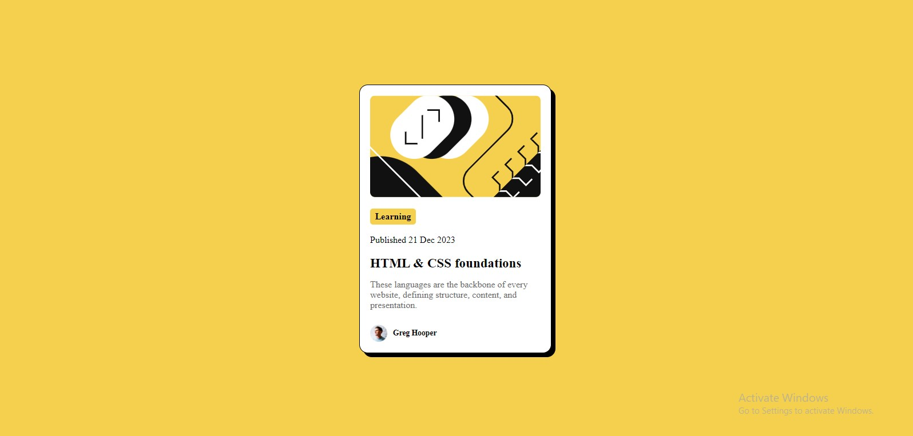
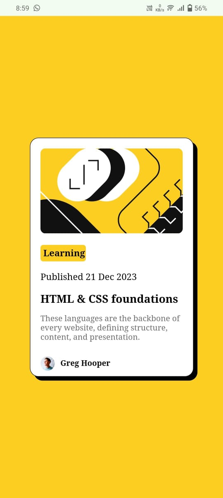

# Frontend Mentor - Blog preview card solution

This is a solution to the [Blog preview card challenge on Frontend Mentor](https://www.frontendmentor.io/challenges/blog-preview-card-ckPaj01IcS). Frontend Mentor challenges help you improve your coding skills by building realistic projects. 

## Table of contents

- [Overview](#overview)
  - [The challenge](#the-challenge)
  - [Screenshot](#screenshot)
  - [Links](#links)
- [My process](#my-process)
  - [Built with](#built-with)
  - [What I learned](#what-i-learned)
  - [Continued development](#continued-development)
- [Author](#author)
- [Acknowledgments](#acknowledgments)

## Overview

This is Blog preview card which is responsive.

### The challenge

Users should be able to:

- Make the card responsive
- Change the color of title while hovering over it

### Screenshot

DESKTOP

MOBILE

### Links

- Solution URL: [Solution](https://github.com/Nandakishor-M/blog-preview-card.git)
- Live Site URL: [Live site](https://nandakishor-m.github.io/blog-preview-card/)

## My process

I used flex property to center the card. I used pseudo-element to give hover effect for the title. Made the web resposive using media query. 
### Built with

- Semantic HTML5 markup
- CSS custom properties
- Flexbox
- Pseudo-element

### What I learned

- I learned about pseudo-elements
- Uses of flex
- To make web responsive
- Use of units like em, rem.

### Continued development

I will continue to learn about CSS and HTML. I will also learn about JavaScript. I will focus more on making the web responsive.

## Author

- Frontend Mentor - [Nandakishor](https://www.frontendmentor.io/profile/Nandakishor-M)
- Github - [Nandakishor-M](https://github.com/Nandakishor-M)

## Acknowledgments

I thank Frontend Mentor for providing this project that helps me to understand more on html semantics and web responsive.